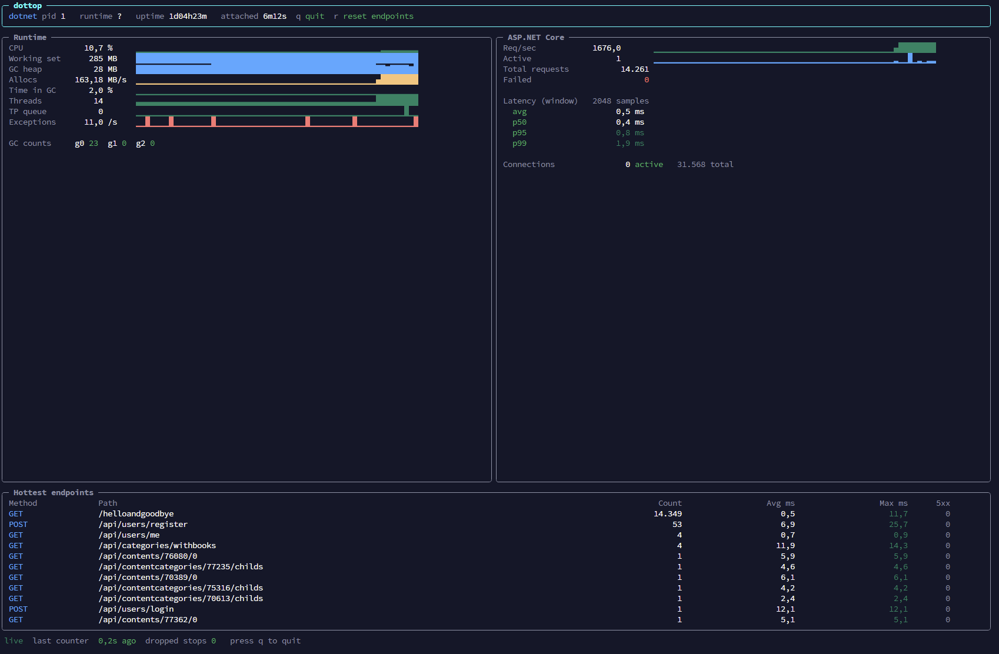

# dottop

> **htop for ASP.NET Core and .NET applications.**
> A zero-configuration, terminal-based real-time monitor that attaches to any running .NET process and streams live runtime + ASP.NET Core metrics — no SDK integration, no code change, no restart.

<p align="center">
  
</p>

> **Note:** this is a vibecoded project — built in a single sitting with heavy AI assistance. It's been smoke-tested against real ASP.NET Core apps and the core path works, but expect rough edges and missing corner cases. Issues and PRs welcome.

---

## Why

You have an ASP.NET Core or .NET service running in prod, in a container, or on a server. Something looks weird — latency, memory, exceptions, thread pool starvation — and you want to look **right now** without:

- Adding a profiler or APM SDK
- Restarting the process
- Setting up Prometheus, Grafana, OpenTelemetry
- Capturing a 200 MB `.nettrace` and analyzing it in PerfView

`dottop` attaches over the .NET diagnostics port (the same channel `dotnet-counters` and `dotnet-trace` use), subscribes to runtime + ASP.NET Core EventPipe providers, and renders everything in a Spectre.Console htop-style UI.

---

## Features

- **Zero configuration** — no code changes, no SDK references, no app restart
- **Auto-discovery** — finds every running .NET process under your user
- **Three ways to attach** — interactive picker, by PID, by partial process name
- **Live runtime metrics** — CPU, working set, GC heap, allocation rate, time-in-GC, gen 0/1/2 counts, thread pool size + queue, exception rate
- **Live ASP.NET Core metrics** — req/sec, active requests, total/failed counts, Kestrel connection stats
- **Per-request latency tracking** — correlated by ActivityID, p50 / p95 / p99 over a sliding window
- **Hottest endpoints table** — top routes by traffic, with avg / max latency and 5xx counts
- **Sparklines everywhere** — Unicode block-character mini-charts for trend at a glance
- **Cross-platform** — Linux x64 / arm64, Windows x64, Alpine (musl)
- **Single self-contained binary** — no .NET runtime needed on the target

---

## Install

Grab the latest single-file binary from the [Releases](../../releases) page.

### Linux (glibc — Debian, Ubuntu, RHEL, etc.)

```bash
curl -sLO https://github.com/ismkdc/dottop/releases/latest/download/dottop-0.1.1-linux-x64.tar.gz
tar -xzf dottop-*-linux-x64.tar.gz
sudo install -m 755 dottop /usr/local/bin/dottop
dottop --help
```

### Linux ARM64 (e.g. Raspberry Pi 4/5, AWS Graviton)

```bash
curl -sLO https://github.com/ismkdc/dottop/releases/latest/download/dottop-0.1.1-linux-arm64.tar.gz
tar -xzf dottop-*-linux-arm64.tar.gz
sudo install -m 755 dottop /usr/local/bin/dottop
```

### Alpine / musl

```bash
curl -sLO https://github.com/ismkdc/dottop/releases/latest/download/dottop-0.1.1-linux-musl-x64.tar.gz
tar -xzf dottop-*-linux-musl-x64.tar.gz
sudo install -m 755 dottop /usr/local/bin/dottop
```

### Windows

Download `dottop-0.1.1-win-x64.zip` from Releases, extract `dottop.exe`, drop it on your `PATH`.

---

## Usage

### Pick from a list

```
$ dottop
   PID   Name                          Runtime        Uptime        Diagnostics
  4211   payment-api                   10.0.0         2h13m         ready
  9120   worker-jobs                   8.0.16         5d04h         ready
```

If only one .NET process is found it attaches automatically.

### Attach directly

```bash
dottop attach 4211          # by PID
dottop attach payment-api   # by process name (substring match)
```

### Non-interactive probe (great for SSH, CI, scripts)

Listen for a few seconds, print captured counters / endpoints / latency, exit:

```bash
dottop probe payment-api --seconds 5
```

### Keys

| Key   | Action                       |
|-------|------------------------------|
| `q` / `Esc` | quit                   |
| `r`   | reset the endpoints table    |
| `Ctrl+C` | quit                      |

### Options

```
dottop [--interval <SECONDS>]
dottop attach <pid|name> [--interval <SECONDS>]
dottop probe  <pid|name> [--seconds <N>]
```

`--interval` controls EventCounter sampling (default 1s).

---

## Running against a Docker container

The .NET diagnostics socket lives inside the container's `/tmp`, so attaching from the host won't see it directly. Two clean paths:

### A) Copy + exec (recommended)

```bash
# Identify the container
docker ps | grep dotnet

# Copy the binary in (one time)
docker cp /usr/local/bin/dottop <container>:/tmp/dottop

# Attach
docker exec -it <container> /tmp/dottop
docker exec -it <container> /tmp/dottop attach <name>
docker exec -i  <container> /tmp/dottop probe <name> -s 5
```

If the container is Alpine-based use the musl build.

### B) nsenter (no `docker cp`)

You can reach into a container's namespaces directly from the host:

```bash
HOSTPID=$(docker inspect --format '{{.State.Pid}}' <container>)
sudo cp /usr/local/bin/dottop /proc/$HOSTPID/root/tmp/dottop
sudo nsenter -t $HOSTPID -m -p -u -i -- /tmp/dottop
```

`-m -p -u -i` enters the mount, PID, UTS and IPC namespaces. dottop now sees the container-local `/tmp` and PID space.

### Mapping host PIDs to containers

```bash
for pid in $(pgrep -f 'dotnet|\.dll'); do
  cid=$(grep -oE '[0-9a-f]{64}' /proc/$pid/cgroup | head -1)
  name=$(docker inspect --format '{{.Name}}' "$cid" 2>/dev/null)
  echo "host PID $pid → container ${cid:0:12} ($name)"
done
```

---

## Running against Kubernetes

```bash
kubectl cp ./dottop my-namespace/my-pod:/tmp/dottop
kubectl exec -it -n my-namespace my-pod -- /tmp/dottop
```

For sidecar / ephemeral-debug containers, mount an `emptyDir` and start `dottop` from there.

---

## Captured metrics

### Runtime (`System.Runtime`)

| Metric            | Source counter                  |
|-------------------|---------------------------------|
| CPU %             | `cpu-usage`                     |
| Working set MB    | `working-set`                   |
| GC heap MB        | `gc-heap-size`                  |
| Allocation rate   | `alloc-rate`                    |
| Time in GC %      | `time-in-gc`                    |
| Gen 0 / 1 / 2 count | `gen-0/1/2-gc-count`          |
| Thread count      | `threadpool-thread-count`       |
| Thread pool queue | `threadpool-queue-length`       |
| Exceptions / s    | `exception-count`               |

### ASP.NET Core (`Microsoft.AspNetCore.Hosting`)

| Metric         | Source                                  |
|----------------|-----------------------------------------|
| Requests / sec | `requests-per-second`                   |
| Total requests | `total-requests`                        |
| Active         | `current-requests`                      |
| Failed         | `failed-requests`                       |
| Per-endpoint count / avg / max / 5xx | `RequestStart` + `RequestStop` events correlated via TPL ActivityID |
| p50 / p95 / p99 latency | same                          |

### Kestrel (`Microsoft-AspNetCore-Server-Kestrel`)

Current and total connections.

---

## How it works

```
┌──────────────────────────────────────────────────────────────────────────┐
│  dottop                                                                   │
│                                                                           │
│  ┌──────────────┐    ┌────────────────────┐    ┌────────────────────┐    │
│  │  Discovery   │──▶│  Diagnostics layer  │──▶│ Metrics aggregator │    │
│  │              │    │  EventPipeSession   │    │  - time series     │    │
│  │ GetPublished │    │  TraceEvent pump    │    │  - latency window  │    │
│  │ Processes()  │    │  - System.Runtime   │    │  - endpoint table  │    │
│  │              │    │  - AspNetCore.*     │    │                    │    │
│  └──────────────┘    │  - Kestrel          │    └─────────┬──────────┘    │
│                      │  - TplEventSource   │              │               │
│                      │    (ActivityID)     │              ▼               │
│                      └─────────┬───────────┘    ┌────────────────────┐    │
│                                │ IPC over        │  Spectre.Console    │   │
│                                ▼ /tmp socket     │  Live dashboard     │   │
│                      ┌────────────────────┐      └────────────────────┘    │
│                      │  Target .NET app   │                                │
│                      └────────────────────┘                                │
└──────────────────────────────────────────────────────────────────────────┘
```

Key design notes:

- Uses `Microsoft.Diagnostics.NETCore.Client` to enumerate processes and open an `EventPipeSession`
- Parses the Nettrace stream with `Microsoft.Diagnostics.Tracing.TraceEvent`
- Enables `System.Threading.Tasks.TplEventSource` keyword `0x80` (TasksFlowActivityIds) — without this every ASP.NET Core `RequestStart`/`RequestStop` event arrives with an empty `ActivityID` and correlation is impossible. This is the single biggest gotcha when writing this kind of tool by hand.
- All metric state lives in lock-protected ring buffers + a `ConcurrentDictionary` for endpoints. The UI just reads snapshots.

---

## Build from source

Requires the **.NET 10 SDK**.

```bash
git clone https://github.com/ismkdc/dottop.git
cd dottop
dotnet build -c Release
dotnet run --project src/DotTop -- --help
```

### Cross-publish a single-file binary

```bash
# Linux x64 (glibc)
dotnet publish src/DotTop -c Release -r linux-x64   --self-contained true \
  -p:PublishSingleFile=true -p:IncludeNativeLibrariesForSelfExtract=true \
  -p:EnableCompressionInSingleFile=true \
  -o publish/linux-x64

# Linux arm64
dotnet publish src/DotTop -c Release -r linux-arm64 --self-contained true \
  -p:PublishSingleFile=true -p:IncludeNativeLibrariesForSelfExtract=true \
  -o publish/linux-arm64

# Alpine / musl
dotnet publish src/DotTop -c Release -r linux-musl-x64 --self-contained true \
  -p:PublishSingleFile=true -p:IncludeNativeLibrariesForSelfExtract=true \
  -o publish/linux-musl-x64

# Windows x64
dotnet publish src/DotTop -c Release -r win-x64    --self-contained true \
  -p:PublishSingleFile=true -p:IncludeNativeLibrariesForSelfExtract=true \
  -o publish/win-x64
```

Output is one ~30–40 MB self-contained executable. No .NET runtime needs to be installed on the target.

---

## Release pipeline

CI lives in [`.github/workflows`](.github/workflows):

- **`ci.yml`** — builds + cross-publishes a sanity binary on every push to `main` / `master` and every PR.
- **`release.yml`** — on push to the **`release`** branch (or manual `workflow_dispatch`):
  1. Cross-publishes single-file binaries for `linux-x64`, `linux-arm64`, `linux-musl-x64`, and `win-x64`.
  2. Packages each as a tarball / zip with a `SHA256SUMS` file.
  3. Creates a GitHub Release tagged `v0.1.<run_number>` (override via `version_suffix` input) and uploads the artifacts.

Promote to a release by merging into `release`:

```bash
git checkout release
git merge main
git push origin release
```

The workflow runs, a new release appears with all four binaries attached.

---

## Troubleshooting

### "No running .NET processes were found"

The diagnostics socket lives in the **target process's** `/tmp`. Common reasons it's not visible:

- **You ran as a different user.** Run as the same user (`sudo -u <appuser> dottop`), or as root.
- **`systemd` `PrivateTmp=yes`.** The socket is under `/tmp/systemd-private-…/tmp/`. Either disable `PrivateTmp`, or use `nsenter -t <pid> -m -p` from the host.
- **Inside a container.** See [Running against a Docker container](#running-against-a-docker-container).
- **`DOTNET_EnableDiagnostics=0`** is set on the target — diagnostics are disabled. Remove the env var and restart.
- **The process is not .NET 5+** — older .NET / Mono / .NET Framework don't expose this diagnostic port.

Quick scan for where any .NET diagnostic sockets actually live:

```bash
sudo find /tmp /var/tmp -name 'dotnet-diagnostic-*-socket' 2>/dev/null
```

### "Failed to start EventPipe session"

The diagnostics port file exists but connect failed. Usually a permissions issue — try `sudo`, or run as the target's user.

### Latency reads zero with traffic flowing

`dottop` correlates `RequestStart`/`RequestStop` via TPL ActivityIDs. If the ASP.NET host has aggressive event filtering (custom `EventListener` flushing things) this can drop. Open an issue with a repro and the output of `dottop probe <pid> -s 10`.

### UI looks garbled over SSH

Make sure SSH allocates a TTY: `ssh -t user@host dottop`. Or use `dottop probe` for non-interactive output.

---

## Roadmap / ideas

- Live request inspector (top N most recent requests, drill-down view)
- Slow-request mode — capture full stack on requests over a threshold
- Hot-methods / mini flamegraph via `SampleProfiler`
- Container / Kubernetes auto-awareness — list pods, cluster-wide discovery
- Pluggable metric sources (custom EventSources)
- Export to JSON / Prometheus

---

## Acknowledgements

- [Spectre.Console](https://spectreconsole.net/) — the gorgeous terminal UI toolkit.
- [Microsoft.Diagnostics.NETCore.Client](https://www.nuget.org/packages/Microsoft.Diagnostics.NETCore.Client) and [Microsoft.Diagnostics.Tracing.TraceEvent](https://www.nuget.org/packages/Microsoft.Diagnostics.Tracing.TraceEvent) — the same libraries that power `dotnet-counters`, `dotnet-trace`, and PerfView.

## License

MIT — see [LICENSE](LICENSE).
